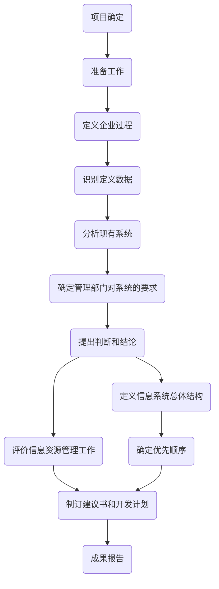

# 信息系统建设

## 信息系统的类型

> 信息系统可以按照**应用层次**和**数据环境**来进行分类。

**按应用层次分类**
    
|分类  |使用者    |举例   |
|---|---|---|
|战略级|企业最高管理层|决策系统、商业智能系统|
|战术级|企业中层经理及其管理部门|客户关系系统|
|操作级|服务型企业的业务部门|订单录入、课程管理|
|事务级|企业的管理业务人员|单据审批|

**按数据环境分类**

* 数据文件
* 应用数据库
* 主题数据库
* 信息检索系统

### 大型信息系统

**特点：**规模庞大、跨地域性、网络结构复杂、业务种类繁多、数据量大、用户量大

> 大型信息系统的特点是大，可从6个维度来理解：规模、地域、网络、业务、数据量、用户量。

## 信息系统规划

**流程**

* 分析企业信息化现状
* 制定企业信息化战略
* 信息系统规划方案拟定和总体架构设计(即信息系统规划的输出)。

**企业信息化的三个阶段**

* 以数据为核心
* 以系统为核心
* 以集成为核心

**方法**

* BSP(Business System Planning)

**原则**

* 支持企业战略目标
* 着眼高层、兼顾中层、满足各业务层
* 整体性和一致性
* 适应于组织架构管理体制
* 便于实施

## 信息系统生命周期

* 立项阶段
* 开发阶段
    * 总体规划------>可能性、可行性。产出：任务书
    * 系统分析------>做什么。产出：逻辑模型、系统说明书
    * 系统设计------>怎么做。产出：物理模型、概要设计、详细设计
    * 系统实施------>做。开发、测试、调试、采购等
    * 系统验收
* 运维阶段
* 消亡阶段

## 信息系统开发方法

| |描述  |优点   |  缺点|
|---|---|---|---|
|结构化法|**用户至上** 严格**区分工作阶段**，每阶段有成果 强调系统开发过程的**整体性**和**全局性** 系统开发过程**工程化**，文档资料**标准化** **自顶向下**，逐步分解（求精），**模块化**|开发目标**清晰化** 开发工作**阶段化** 开发文档**规范化** 设计方法**结构化** |开发周期长 系统难以适应需求环境的变化 很少考虑数据结构 |
|原型法|适用于需求不明确的开发 抛弃型、进化型 周期短、速度快、风险成本低、以用户为中心、用户参与全过程|需求表示清楚，用户满意度高 降低开始风险和开发成本|不适用于大型的系统、技术层面远大于分析层面的系统 系统难于维护 如果用户合作不好，盲目纠缠，会拖延开发进度 |
|面向对象方法|更好的**复用性** 关键在于建立一个全面、合理、统一的模型 分析、设计、实现三个阶段，界限不明确|分析、设计中的对象与软件中的对象一致性 *实现*软件复用、简化程序设计 系统易于维护、缩短开发周期 |需要一定的软件环境支持 不适用于大型的MIS系统开发，若缺乏整体系统设计划分，易造成系统结构不合理、各部分关系失调等问题 初学者不易接受、难学 |
|面向服务方法|快速响应需求和环境的变化 组织内部、组织之间各种应用系统的相互通信和互操作性 提高系统可复用性、信息资源共享和系统间互操作性|快速响应需求和环境变化 *提高*系统可复用性、资源共享和系统间互操作性 |SO方法是一个较新的领域，许多研究和实践还有待进一步深入 |

> 结构化法：主要强调规范、标准、阶段、模块，规范和标准导致难以适应需求和环境变化。

> 原型法：强调用户参与，快速产出用户能看得见、能操作的软件或界面，若系统太复杂，则很难达到此要求。同时，要求与用户合作良好。

> 面向对象：万事万物皆对象。分析、设计中的对象与软件开发中的对象基本一致，导致三者连界限不清晰。**实现复用**、**易维护**、**周期短**。

> 面向服务：一种新型的方法，强制系统间相互通信和操作性（可以是组织内部或组织间的系统）。**提高复用**、**快速适应变化**。
    >> 个人理解：面向服务在软件中使用第三方服务，专业的事由专业的人来做，若有变化，系统可以快速由专业的人来调整。比如系统调用第三方接口，若接口底层的数据有所变化，由第三方进行维护，对于系统开发不需要做任何调整即可适应环境变化。