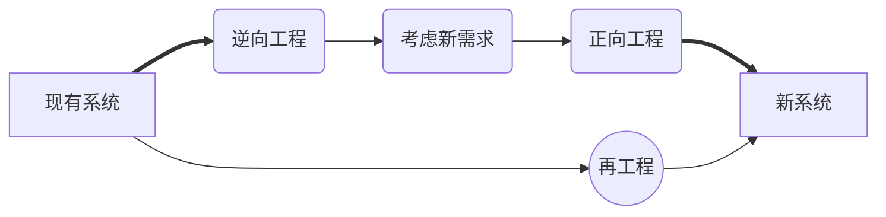

# 软件工程

## 软件开发模型

* **瀑布模型**

    

    > 适用范围：项目需求明确，充分了解可交付的产品。

    > 多用于结构化方法

* **V模型**

    

    > V模型来源于瀑布模型，强调每一个阶段都有测试。在考试中经常会考在某个阶段所对应的测试类型。

    > 助记：扁担（编码---单元测试）、吉祥（详细设计---集成测试）、膝盖（概要设计---系统测试）

    > 图中功能测试==集成测试

* **喷泉模型**

    

    > 主要用于面向对象方法。特点：迭代、无间隙

    > 在教程中，图形省略了维护和确认步骤。

    > 用户需求为动力，对象为驱动。

    > 自下而上，周期的各阶段相互迭代和无间隙。

    * 迭代：某个部分常常重复多次，每次迭代中渐近的加入软件成分。
    * 无间隙：各阶段无明显阶段。
        > 如分析和设计间没有界限。

* **增量模型**

    

    > 一步一步增加软件功能。

    > 增量与迭代的区别：
    > > 增量：每一个版本所增加的功能都是规划好的，是按计划增加的。

    > > 迭代：后面版本增加的功能没有规划，根据前期反馈进行调整。

* **螺旋模型**

    

    > 强调风险，适用于庞大、复杂、高风险的项目。

* **构建组装模型**

    

    > 将模块组成构件，将构件进行组装形成软件。极大的提高了软件开发的复用性，使得软件开发总时长极大减小，使软件的成本降低，可靠性增加。

* **统一过程**

    

    > 以用例为中心，以架构为驱动进行增量和迭代。

    模型将软件工程分为4个阶段：
    * 初始
        * **确定**项目范围和**边界**
        * **识别**系统的关键**用例**
        * **展示**系统的候选**框架**
        * **估计**项目费用和时间
        * **评估**项目**风险**
    * 细化
        * **分析**系统问题领域
        * **建立**软件架构基础
        * **淘汰**最高风险元素
    * 构建
        * **开发**剩余的构件
        * 构件**组装**与**测试**
    * 交付
        * 进行β测试
        * 制作发布版本
        * 用户文档定稿
        * 确认新系统
        * 培训、调整产品

* **敏捷方法**

    其中包含：SCRUM、自适应开发、水晶方法、特征驱动开发、极限编程

    * 4大价值观：沟通、简单、反馈、勇气

        > 敏捷主要讲究快，其价值观表现在：有问题就说（沟通、反馈），越简单越快，有想法就做（勇气）。

    * 5大原则：快速反馈、简单性假设、逐步修改、提倡更改、优质工作。
    * 12大最佳实践：
        * 小版本、规划游戏、现场客户
        * 隐喻、简单设计、重构
        * 测试驱动开发、持续集成、结对编程
        * 代码共有、编码标准、每周工作40个小时
    * 敏捷开发宣言
        1. N个体和**交互**，胜过过程和工具
        2. N可以工作的**软件**，胜过面面俱到的文档
        3. N客户**合作**，胜过合同谈判
        4. N响应**变化**，胜过遵循计划

### 各种软件开发模型的特点

|模型名称|技术特点|适用范围|
|---|---|---|
|瀑布模型|简单、**分阶段**、阶段间存在因果关系，各个阶段完成后都有评审，允许反馈，不支持用户参与，要求预先确定需求。|**需求易于完善**定义且**不易变更**的软件系统。|
|V模型|测试过程作为在需求分析、概要设计、详细设计及编码之后 的一个阶段，等到软件编码完成后才开始测试工作。|时间充裕的系统。|
|喷泉模型|迭代、无间隙。|面向对象的软件开发。
|迭代模型|不要求一性性开发出完整的软件系统，将软件开发视为**逐步获取用户需求、完善软件产品**的过程。|**需求难以确定**，**不断变更**的软件系统。|
|螺旋模型|结合瀑布模型和迭代模型的思想，并引入了风险分析的活动。|**需求难以获取和确定**，软件开发**风险较大**的软件系统。|
|统一过程|可改造、扩展和裁剪；可以对它进行设计、开发、维护和发布；强调迭代开发。|**复杂和需求难以获和确定**的软件系统；项目组拥有丰富的软件开发和管理**经验**。|
|敏捷方法|拥抱变化、较少的文档、简单的设计；持续集成、小步快走。|**小**型项目，小型团队，需求**快速**变化。|

## 软件过程改进

* 帮助软件开发企业对其软件开发过程的改变进行计划、措施制度以及实施。实施对象是企业的软件过程。也包括软件维护之类的维护过程，而对于其它的过程并不关注。

> * 软件开发过程
> * 软件维护过程

* 实施软件过程改进的最根本利益在于，它能够极大的**提高项目成功的概率**。

* **原则**
    * 注重**问题**
    * 强调知识**创新**
    * 鼓励**参与**
    * 领导层的**统一**
    * 计划不断的**改进**

## 软件开发方法

### 逆向工程

> 发生在软件维护阶段。

### 需求工程

> 软件需求是指用户对系统在功能、行为、性能、设计约束方面的期望。

需求阶段所使用的工具有：层次方框图、Warnier图、用例图和IPO图。

* **需求分类** *需求的层次*

    * 业务需求 *高层次的目标*
    * 用户需求 *用户要求必须能完成的任务*
    * 系统需求
        * 功能需求 *开发人员必须完成的任务*
        * 非功能需求 *系统必须具备的属性或品质*
            * 软件质量属性
                * 易用性
                * 可维护性
                * 效率
            * 其它非功能需求
        * 设计约束
            > 限制条件或补充规约。如：必须使用国产数据库，必须运行在Unix系统下等。

* **质量功能部署(QFD)** *Quality Function Deployment*

    * 基本需求
    * 期望需求
    * 兴奋需求
        > 也叫意外需求

* **需求开发**

    * 需求获取
        > 确定和理解不同的项目干系人的需求和约束的过程。
    * 需求分析
        * 检测和解决需求之间的冲突
        * 发现软件的边界，以及软件与其环境如何交互
        * 详细描述系统需求，以导出软件需求

    > 使用SA(Structured Analysis)方法进行需求分析时，以数据字典为核心，建立数据模型、行为模型、功能模型。
    > * 数据模型：使用实体联系图（E-R图）表示
    > * 功能模型：使用数据流图（Data Flow Diagram,DFD）表示
    > * 行为模型：也称状态转换模型，用状态转换图（State Transform Diagram,STD）表示
        
    * 需求定义
        > 完成《需求规格说明书（SRS）》的编写。

        > 需求规格说明书：Software Requirement Specification
        > * 范围
        > * 引用文件
        > * 需求
        > * 合格性规定
        > * 需求可追踪性
        > * 尚未解决的问题
        > * 注解
        > * 附录
    * 需求验证
        * 需求评审
        * 需求测试

### 架构设计

> **软件架构**：描述软件系统的**子系统和构件**（组件），以及它们**之间关系**的学科。

> **架构设计**：需求分配。即将满足需求的职责分配到构件上。

> **架构视图**：从某一视角或某一点上看到的系统所做的简化描述，描述中涵盖系统的某一特定方面，而省略了与此方面无关的实体。

* **4+1视图**

    

    * 逻辑视图：支持系统的功能需求，从最终用户的视角来查看。
    * 开发视图：也称模块视图、实现视图，关注实际的软件开发环境中的模块组织，从开发者角度松查看。
    * 运行视图：也称处理视图。侧重系统的运行特性，关注非功能需求，强调并发性、分布性、系统集成性和容错能力。从系统管理员角度查看。
    * 部署视图：将软件映射到硬件上。考虑系统性能、规模、可靠性等。从系统管理员角度查看。
    * 场景视图：也称用例视图。最重要的需求抽象，上面4个视图通过场景一起无缝工作。

* **架构风格**

    > * 反映了领域中从多系统所共有的结构和语义特性，并指导如何将各个构件有效的组织成一个完整的系统。
    > * 定义了用于描述系统的术语表和一组指导构件系统的规则。
    > * 基于**敏感点**和**权衡点**来评估架构风格
    > * 评估的方式有：
    >    * 调查问卷
    >    * 场景
    >    * 度量

    * 数据流风格
        * 批处理序列
        * 管道-过滤器
    * 调用/返回风格
        * 主程序/子程序
        * 面向对象
        * 层次结构
    * 独立构件风格
        * 进程通信
        * 事件驱动系统（隐式调用）
    * 虚拟机风格
        * 解释器
        * 基于规则的系统
    * 仓库风格
        * 数据库系统
        * 超文本系统
        * 黑板系统

## 软件设计

## 软件测试

## 系统运行与维护

## 软件复用

## 软件开发环境
