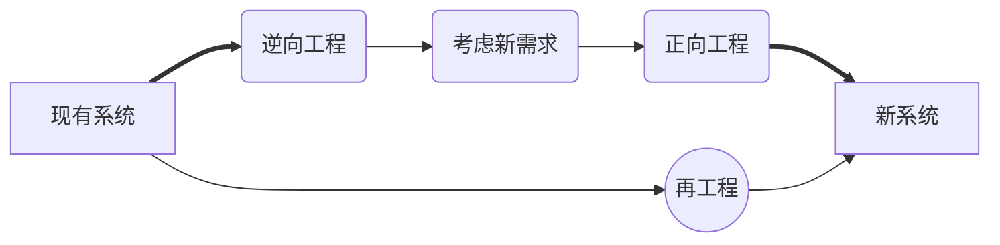

# 软件工程

## 软件开发模型

* **瀑布模型**

    

    > 适用范围：项目需求明确，充分了解可交付的产品。

    > 多用于结构化方法

* **V模型**

    

    > V模型来源于瀑布模型，强调每一个阶段都有测试。在考试中经常会考在某个阶段所对应的测试类型。

    > 助记：扁担（编码---单元测试）、吉祥（详细设计---集成测试）、膝盖（概要设计---系统测试）

    > 图中功能测试==集成测试

* **喷泉模型**

    

    > 主要用于面向对象方法。特点：迭代、无间隙

    > 在教程中，图形省略了维护和确认步骤。

    > 用户需求为动力，对象为驱动。

    > 自下而上，周期的各阶段相互迭代和无间隙。

    * 迭代：某个部分常常重复多次，每次迭代中渐近的加入软件成分。
    * 无间隙：各阶段无明显阶段。
        > 如分析和设计间没有界限。

* **增量模型**

    

    > 一步一步增加软件功能。

    > 增量与迭代的区别：
    > > 增量：每一个版本所增加的功能都是规划好的，是按计划增加的。

    > > 迭代：后面版本增加的功能没有规划，根据前期反馈进行调整。

* **螺旋模型**

    

    > 强调风险，适用于庞大、复杂、高风险的项目。

* **构建组装模型**

    

    > 将模块组成构件，将构件进行组装形成软件。极大的提高了软件开发的复用性，使得软件开发总时长极大减小，使软件的成本降低，可靠性增加。

* **统一过程**

    

    > 以用例为中心，以架构为驱动进行增量和迭代。

    模型将软件工程分为4个阶段：
    * 初始
        * **确定**项目范围和**边界**
        * **识别**系统的关键**用例**
        * **展示**系统的候选**框架**
        * **估计**项目费用和时间
        * **评估**项目**风险**
    * 细化
        * **分析**系统问题领域
        * **建立**软件架构基础
        * **淘汰**最高风险元素
    * 构建
        * **开发**剩余的构件
        * 构件**组装**与**测试**
    * 交付
        * 进行β测试
        * 制作发布版本
        * 用户文档定稿
        * 确认新系统
        * 培训、调整产品

* **敏捷方法**

    其中包含：SCRUM、自适应开发、水晶方法、特征驱动开发、极限编程

    * 4大价值观：沟通、简单、反馈、勇气

        > 敏捷主要讲究快，其价值观表现在：有问题就说（沟通、反馈），越简单越快，有想法就做（勇气）。

    * 5大原则：快速反馈、简单性假设、逐步修改、提倡更改、优质工作。
    * 12大最佳实践：
        * 小版本、规划游戏、现场客户
        * 隐喻、简单设计、重构
        * 测试驱动开发、持续集成、结对编程
        * 代码共有、编码标准、每周工作40个小时
    * 敏捷开发宣言
        1. N个体和**交互**，胜过过程和工具
        2. N可以工作的**软件**，胜过面面俱到的文档
        3. N客户**合作**，胜过合同谈判
        4. N响应**变化**，胜过遵循计划

### 各种软件开发模型的特点

|模型名称|技术特点|适用范围|
|---|---|---|
|瀑布模型|简单、**分阶段**、阶段间存在因果关系，各个阶段完成后都有评审，允许反馈，不支持用户参与，要求预先确定需求。|**需求易于完善**定义且**不易变更**的软件系统。|
|V模型|测试过程作为在需求分析、概要设计、详细设计及编码之后 的一个阶段，等到软件编码完成后才开始测试工作。|时间充裕的系统。|
|喷泉模型|迭代、无间隙。|面向对象的软件开发。
|迭代模型|不要求一性性开发出完整的软件系统，将软件开发视为**逐步获取用户需求、完善软件产品**的过程。|**需求难以确定**，**不断变更**的软件系统。|
|螺旋模型|结合瀑布模型和迭代模型的思想，并引入了风险分析的活动。|**需求难以获取和确定**，软件开发**风险较大**的软件系统。|
|统一过程|可改造、扩展和裁剪；可以对它进行设计、开发、维护和发布；强调迭代开发。|**复杂和需求难以获和确定**的软件系统；项目组拥有丰富的软件开发和管理**经验**。|
|敏捷方法|拥抱变化、较少的文档、简单的设计；持续集成、小步快走。|**小**型项目，小型团队，需求**快速**变化。|

## 软件过程管理

### 能力成熟度

在软件过程管理方面，最著名的是能力成熟度模型集成(Capability Maturity Model Integration,CMMI)，它**融合**了**多种模型**，**形成**了组织范围内过程改进的**单一集成模型**，其主要目的是**消除**不同模型之间的**不一致和重复**，**降低**基于模型进行改进的**成本**。

* **过程域的阶段式分组**

|成熟度等级|过程域|
|---|---|
|初始级| |
|可管理级/可重复级|需求管理、项目计划、配置管理、项目监督与控制、供应商合同管理、度量和分析、过程和产品质量保证|
|已定义级|需求开发、技术解决方案、产品集成、验证、确认、组织级过程焦点、组织级过程定义、组织级培训、集成项目管理、风险管理、集成化的项目团队、决策分析和解决方案、组织级集成环境
|量化管理级|组织级过程性能、定量项目管理|
|优化管理级|组织级改革与实施、因果分析和解决方案|

> * 初始级
> > 无序、混乱、没有定义、成功取决于个人努力、管理是反应式的。
> * 可管理级
> > 建立了基本的管理过程来跟踪费用、进度和功能特性。制定了必要的过程纪律，**能重复早先类似应用项目取得成功的经验**。**经验可复用**。
> * 已定义级
> > 已将软件管理和工程两方面的过程**标准化**、**文档化**，并综合成该组织的标准软件过程。所有项目均使用经批准的、裁剪的标准软件过程来开发和维护软件，软件产品的生产在整个软件的过程是可见的。
> * 量化管理级
> > **分析**对软件过程和产品质量的**详细数据**，对软件产品和过程都有定量的理解和控制。管理有一个作出结论的客观依据，管理能够在定量的范围内**预测性能**。
> * 优化管理级
> > 过程的量化反馈和先进的新思想、新技术促进过程**持续不断改进**。

* **连续式模型的过程域分组**

|连续式分组|过程域|
|---|---|
|过程管理|组织级过程焦点、组织级过程定义、组织级培训、组织级过程性能、组织级改革与实施|
|项目管理|项目计划、项目监控与控制、供应商合同管理、集成项目管理、风险管理、集成化的团队、定量项目管理|
|工程|需求管理、需求开发、技术解决方案、产品集成、验证、确认|
|支持|配置管理、度量和分析、过程和产品质量保证、决策分析和解决方案、组织级集成环境、因果分析和解决方案|

### 过程改进
* 帮助软件开发企业对其软件开发过程的改变进行计划、措施制度以及实施。实施对象是企业的软件过程。也包括软件维护之类的维护过程，而对于其它的过程并不关注。

> * 软件开发过程
> * 软件维护过程

* 实施软件过程改进的最根本利益在于，它能够极大的**提高项目成功的概率**。

* **原则**
    * 注重**问题**
    * 强调知识**创新**
    * 鼓励**参与**
    * 领导层的**统一**
    * 计划不断的**改进**

## 软件开发方法

### 逆向工程

> 发生在软件维护阶段。

### 需求工程

> 软件需求是指用户对系统在功能、行为、性能、设计约束方面的期望。

需求阶段所使用的工具有：层次方框图、Warnier图、用例图和IPO图。

* **需求分类** *需求的层次*

    * 业务需求 *高层次的目标*
    * 用户需求 *用户要求必须能完成的任务*
    * 系统需求
        * 功能需求 *开发人员必须完成的任务*
        * 非功能需求 *系统必须具备的属性或品质*
            * 软件质量属性
                * 易用性
                * 可维护性
                * 效率
            * 其它非功能需求
        * 设计约束
            > 限制条件或补充规约。如：必须使用国产数据库，必须运行在Unix系统下等。

* **质量功能部署(QFD)** *Quality Function Deployment*

    * 基本需求
    * 期望需求
    * 兴奋需求
        > 也叫意外需求

* **需求开发**

    * 需求获取
        > 确定和理解不同的项目干系人的需求和约束的过程。
    * 需求分析
        * 检测和解决需求之间的冲突
        * 发现软件的边界，以及软件与其环境如何交互
        * 详细描述系统需求，以导出软件需求

    > 使用SA(Structured Analysis)方法进行需求分析时，以数据字典为核心，建立数据模型、行为模型、功能模型。
    > * 数据模型：使用实体联系图（E-R图）表示
    > * 功能模型：使用数据流图（Data Flow Diagram,DFD）表示
    > * 行为模型：也称状态转换模型，用状态转换图（State Transform Diagram,STD）表示
        
    * 需求定义
        > 完成《需求规格说明书（SRS）》的编写。

        > 需求规格说明书：Software Requirement Specification
        > * 范围
        > * 引用文件
        > * 需求
        > * 合格性规定
        > * 需求可追踪性
        > * 尚未解决的问题
        > * 注解
        > * 附录
    * 需求验证
        * 需求评审
        * 需求测试

### 架构设计

> **软件架构**：描述软件系统的**子系统和构件**（组件），以及它们**之间关系**的学科。

> **架构设计**：需求分配。即将满足需求的职责分配到构件上。

> **架构视图**：从某一视角或某一点上看到的系统所做的简化描述，描述中涵盖系统的某一特定方面，而省略了与此方面无关的实体。

* **4+1视图**

    

    * 逻辑视图：支持系统的功能需求，从最终用户的视角来查看。
    * 开发视图：也称模块视图、实现视图，关注实际的软件开发环境中的模块组织，从开发者角度松查看。
    * 运行视图：也称处理视图。侧重系统的运行特性，关注非功能需求，强调并发性、分布性、系统集成性和容错能力。从系统管理员角度查看。
    * 部署视图：将软件映射到硬件上。考虑系统性能、规模、可靠性等。从系统管理员角度查看。
    * 场景视图：也称用例视图。最重要的需求抽象，上面4个视图通过场景一起无缝工作。

* **架构风格**

    > * 反映了领域中从多系统所共有的结构和语义特性，并指导如何将各个构件有效的组织成一个完整的系统。
    > * 定义了用于描述系统的术语表和一组指导构件系统的规则。
    > * 基于**敏感点**和**权衡点**来评估架构风格
    > * 评估的方式有：
    >    * 调查问卷
    >    * 场景
    >    * 度量

    * 数据流风格
        * 批处理序列
        * 管道-过滤器
    * 调用/返回风格
        * 主程序/子程序
        * 面向对象
        * 层次结构
    * 独立构件风格
        * 进程通信
        * 事件驱动系统（隐式调用）
    * 虚拟机风格
        * 解释器
        * 基于规则的系统
    * 仓库风格
        * 数据库系统
        * 超文本系统
        * 黑板系统

## 软件设计

* 概要设计
* 详细设计（设计模型、微观）
    * 自顶向下、逐步求精
    * 信息隐蔽
    * 模块独立（高内聚、低耦合）

### 设计模式

* 按处理范围分：
    * 类模式（静态模式）
    * 对象模式（动态模式）

    > 类是在开发阶段存在的，对象是类实例化后产生的。对象是在运行时才会实例化，所以是动态模式。
* 按目的和用途分：
    * 创建型 创建对象
        * 工厂模式
        * 抽象模式
        * 单例模式
        * 原型模式
        * 创建者模式
    * 结构型 处理类或对象组合
        * 适配器模式
        * 桥接模式
        * 组合模式
        * 装饰模式
        * 代理模式
    * 行为型 交互与职责分配
        * 链模式
        * 命令模式
        * 解释器模式
        * 迭代器模式
        * 中介者模式

## 软件测试

### 测试原则

* 尽早、不断的进行测试
* 程序员避免测试自己设计的程序
* 既要选择有效、合理的数据，也要选择无效、不合理的数据
* 修改后应进行回归测试
* 尚未发现的错误数量与已发现的错误数量成正比
    > 如果有10个测试用例，已经测试了3个用例，发现3个错误，则可以预测剩下的7个用例将发现7个用例。

### 测试方法

* 动态测试
    * 黑盒测试---用于功能测试（集成测试）
        * 等价类划分
        * 边界值分析
        * 错误推测
        * 因果图
    * 白盒测试---用于单元测试阶段
        * 语句覆盖
        * 判定覆盖
        * 条件覆盖
        * 判定/条件覆盖
        * 条件组合覆盖
        * 路径覆盖
* 静态测试
    * 针对文档
        * 检查单
    * 针对代码
        * 桌前检查---开发人员做
        * 代码审查---需求、开发、测试人员来做
        * 代码走查---测试工程师做

### 测试类型

* **按照开发阶段划分**
    * 单元测试---单元功能、单元接口
    * 集成测试---模块间接口测试、模块间数据传递、全局数据结构测试
    * 确认测试---验证软件功能、性能及其它特性是否与用户需求一致
    * 系统测试---从用户角度对系统功能验证，非功能性验证
    * 验收测试---整个系统的测试与评审，决定是否接受系统的测试与评价

* **按照测试技术划分**
    * 黑盒测试---对功能、界面测试
    * 白盒测试---检查所有的结构及路径是否正确
    * 灰盒测试---关注输出对输入的正确性、关注内部的表现

* **按照测试实施组织划分**
    * 开发方测试---验证测试、Alpha测试
    * 用户测试---beta测试
    * 第三方测试

> Alpha测试：开发者在正式环境下的测试

> Beta测试：用户在正式环境下的测试。只针对少部分挑选的用户。

* **性能测试** Performance Test

通常收集所有和测试有关的所有性能，通常被不同的人在不同场合下使用。关注点：how much和how fast

> * 负载测试(Load Test)：指系统在超负荷环境中运行，程序是否能够承担。在一定工作负荷下，给系统造成的负荷及系统的响应时间。关注点：how much

> * 压力测试(Stress Test)：在系统资源特别低的情况下软件系统的运行情况，目的是找到系统在哪里失效以及如何失效的地方。在一定负荷条件下，长时间持续运行系统给系统性能造成的影响。

> * 工具：LoadRunner

> * 平均用户并发数：C=NL/T，N是login session的数量，L是login session平均长度，T是考察的时间断。

> * 并发用户峰值数：$$C\approx3\sqrt{C}$$

### 测试管理

* 测试团队管理
* 测试计划管理
* 错误(缺陷)跟踪管理
* 测试软件管理
* 过程管理
    > 测试的过程就是执行用例
* 配置管理
    > 应将软件的工作产品纳入配置管理
* 评审
    > 评审的内容包括：
    > * 测试计划
    > * 测试用例
    > * 测试结果
    > * 测试过程
* 测试人员管理
    * 测试的**负责人**
    * 测试的**分析人员**
    * 测试的**设计人员**
    * 测试的**测试员**
    * 测试的测试**管理员**

> 若A、B两人同时进行测试，分别发现a、b个bug，其中共同的bug数为c，则可以预测总bug数为：$$DN=(a*b)/c$$

## 系统运行与维护

> 软件维护是生命周期的一个完整活动。可以将软件维护定义为需要提供软件支持的全部活动。包括交付前与交付后完成的活动。

* 交付前的维护活动：交付后的**运行计划**和**维护计划**
* 交付后的维护活动：修改、培训、帮助资料等

### 维护的分类

* 改正性维护
    > 改正错误。修改软件中出现的错误
* 适应性维护
    > 适应环境。由于软件运行环境变化所引起的维护
* 完善性维护
    > 完善功能。对功能的增加
* 预防性维护
    > 为新功能做准备。

## 软件复用

> * 指利用已有软件的各种有关知识构造新的软件，以**缩减**软件开和维护的**费用**。
> * 是**提高**软件**生产力**和**质量**的一种重要技术。

* 代码的复用
* 设计的复用
* 分析的复用
* 测试信息的复用

## 软件开发环境

* 建模工具
    > Rational Rose
* 设计工具
    > Power Designer,ERWin
* 开发工具
    > Visual Stdio.NET,Eclipse
* 测试工具
    > LoadRunner
* 项目管理工具
    > Project,Clearcase,VSS,CVS
