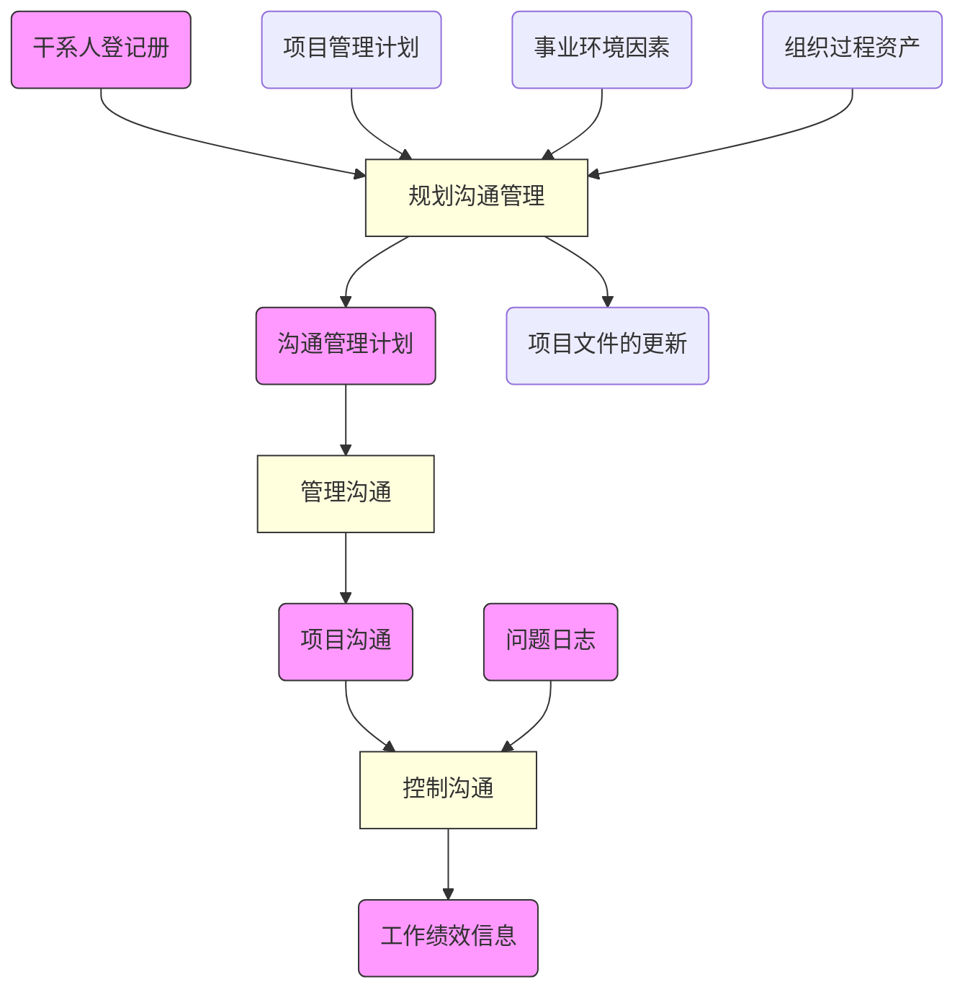

# 项目沟通管理

**Project Communication Managentment**

考点：论文、案例分析

> * 项目沟通管理包括为确保项目信息及时恰当的规划、收集、生成、发布、存储、检索、管理、控制、监督和最终处置所需的各个过程。
> * 项目经理决大多数时间（90%以上）都用于团队成员和其它干系人的沟通

## 沟通管理的过程

|过程|英文名称|解释|
|---|---|---|
|规划沟通管理|Plan Communications Managentment |根据干系人的项目信息需要和需求及组织的可用资产情况，**制定**合适的项目沟通**方式**和**计划**~~的过程~~|
|管理沟通|Managentment Communications|**根据**沟通管理**计划**，生成、收集、分发、存储、检索及最终**处置**项目**信息**~~的过程~~|
|控制沟通|Control Communications|在整个项目生命周期中对沟通进行**监督**和**控制**，以满足干系人对项目信息的需求~~的过程~~|

## 规划沟通管理

识别与记录与干系人最有效率且最有效果的沟通方式。

> * 输入：干系人登记册、项目管理计划、事业环境因素、组织过程资产
> * 工具：沟通需求分析、淘通技术、沟通模型、沟通方法、会议
> * 输出：沟通管理计划、项目文件的更新

* **影响沟通技术的因素**

    * 对信息需求的**紧迫性**
    * **技术是否到位**
    * 预期的项目**人员配备**
    * 项目的**持续时间**
    * 项目**环境**

* **沟通的模型**

    > 在信息的传递过程中，都会存在噪声的干扰

* **沟通的渠道**

    指信息源选择和确立的传送信息的媒价物，也就是指信息传播者传递信息的途径。

    > 渠道数计算公式公式：CC=n*(n-1)/2
    >> n为人的数量

* **沟通的障碍**

    >可能出现在案例题中，让分析沟通中存在的问题

    * 缺乏清晰的**沟通渠道**
    * 发送者与接收者存在**物理距离**
    * 沟通双方彼此技术**语言不通**
    * 分散注意力的**环境因素**（噪声）
    * 有害的**态度**
        > * 敌对
        > * 不信任
    * 权力游戏、滞留信息、隐藏方程与敌对情绪等
        > 此为普通理解的刁难，由信息的掌握一方故意不进行沟通

### 制定沟通管理计划的步骤

1. **确定**干系人的沟通信息**需求**。
    > * 哪些人需要沟通
    > * 谁需要什么信息
    > * 什么时候需要信息
    > * 信息发送方式
2. **描述**信息收集和文件归档的**结构**。
3. **确定**发送信息和重复信息的**格式**。

### 沟通管理计划的内容

* 项目**干系人**的沟通**要求**
* 需要沟通的信息
    > * 语言
    > * 格式
    > * 内容
    > * 详细程度
* 发布信息的原因
* 发布信息及告之收悉或作出回应的时限和频率
* 负责沟通相关信息的人员
* 负责授权保密信息发布的人员
* 将要接收信息的个人或小组
* 传递信息的技术或方法
    > * 备忘录
    > * 电子邮件
    > * 新闻稿
* 为沟通活动分配的资源
    > * 时间
    > * 预算
* 通于术语表
* 沟通制约因素
    > * 法律法规
    > * 技术要求
    > * 组织政策

> 沟通管理计划对所要沟通的内容进行了计划（规定），即干系人要求沟通什么，沟通的信息需要怎么组织起来（格式、语言、内容、详细程度），什么样的信息因为什么样的原因需要发布，普通信息由谁来发布，保密信息需要谁来审核才能发布，什么样的信息需要发给什么样的人，使用什么样的方法来把信息发给接收者（邮件、QQ、备忘录...），在沟通上能够使用的资源（包括时间和预算，即电话可以打多长，可以花多少钱来打电话），制约因素可理解为在沟通的时候必须要满足的要求，比如保密信息只能不能通过互联网传输等。

## 管理沟通

促进干系人之间实现有效率且有效果的沟通。

> * 输入：沟通管理计划、工作绩效报告、事业环境因素、组织过程资产
> * 工具：**信息管理系统**、**报告绩效**、沟通模型、沟通技术、沟通方法
> * 输出：项目沟通、项目管理计划更新、项目文件更新、组织过程资产更新

* **信息管理系统**
    >信息管理系统是管理沟通的一个工具，其管理的内容包括：
    > * **纸质文件**。信件、备忘录、报告和新闻稿。
    > * **电子通信管理**。电子邮件、传真、语音信箱、电话、视频和网络会议、网站和网络出版等。
    > * **项目管理电子工具**。其于网页界面的进度管理工具和项目管理软件、会议和虚拟办公支持软件、门户网站和协同工作管理工具。

* **报告绩效**

    收集和发布绩效信息。包括状况报告、进展测量结果及预测结果。
    > 报告绩效是个动作。

* **绩效报告**

    * 向每个受众适度的提供信息。可定期编制或基于特殊情况编制。
        > 绩效报告是一个名词。绩效报告里包含了信息。
    * 对收集的信息进行组织与归纳，并通过与绩效测量基准的比较，来分析和展示绩效。应按照沟通管理计划的规定，以各干系人所要求的详细程度，向他们**提供**项目**状态**和**进展信息**。
    * **预测**的项目**完工时间**和**成本**，应该根据工作绩效测量结果来更新并重新发布预测。

## 控制沟通

随时确保所有沟通参与者之间信息流动的最优化。

> * 输入：项目沟通、问题日志、项目管理计划、工作绩效数据、组织过程资产
> * 工具：信息管理系统、专家判断、会议
> * 输出：工作绩效信息、变更请求、项目管理计划更新、项目文件更新、组织过程资产更新

* **关注的特性**

    * 持续性。
        > 控制沟通的过程中，可能引发重新制订沟通管理计划或管理沟通过程。
    * 特殊性。
        > 对某些特定信息的沟通（问题或关键绩效指标：实际成本、进度、质量与计划要求的比较结果），可能立即引发修正措施。
    * 正确性。
        > 应仔细的评估和控制项目沟通的影响和对影响的反应，确定正确的时间把正确的信息以正确的方式传递给正确的受众。

## 如何改进项目沟通

> 本节知识点可用于案例和论文题。

* **沟通的基本原则**

    * 沟通的内外有别
    * 非正式的沟通有助于关系的融洽。
        > 私下的讨论
    * 采用对方能接受的沟通风格
    * 沟通的升级原则
        > 不要越级反应问题
    * 扫除沟通的障碍

* **人际沟通风格**

    * 理性型
    * 实践型
    * 亲和型
    * 理想型

* **改进方法**

    * **使用**信息管理**系统**
    * **建立**沟通基础**设施**
    * 使用项目沟通**模板**
    * 把握项目沟通基本**原则**
    * 发展更好的沟通**技能**
    * 把握人际沟通**风格**
    * 进行良好的**冲突管理**
    * 召开**高效**的**会议**

* **高效的会议**

    * 事先制订一个例会制度
    * 放弃可开可不开的会议
    * 明确会议的目的和期望结果
    * 发布会议通知
    * 在会议前将会议资料发给参会人员
    * 可以借助视频设备
    * 明确会议规则
    * 会议要有记录
    * 会后要有总结，提炼结论

    **项目例会**

    * 是内部沟通主要平台
    * 以周为单位
    * 由项目经理主持

        **主要议题**

        * 项目**进展**程度调查和汇报
        * 项目**问题的解决**
        * 项目潜在**风险的评估**
        * 项目团队人力**资源的协调**

## 数据流图

