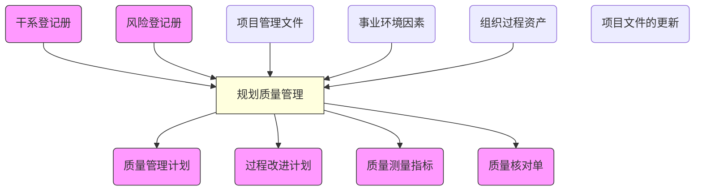

# 项目质量管理

Project Quality Management

考点：案例和论文

## 质量管理理论

* **相关概念**
    * **质量**：一组固有特性满足需求的程度。需求指明示的、通常隐含的或必须履行的需求或期望。特性指可区分的特征——可以是固有的或赋予的、定性的或定量的、有各种类别的（物理的、感官的、行为的、时间的、功能的等）。
    * **质量管理**：在质量方面指挥和控制组织的协调的活动，通常包括制定质量方针和质量目标以及质量策划、质量控制、质量保证和质量改进。
    * 质量方针：由组织的最高管理者正式发布的该组织总的质量宗旨和方向。它体现了该组织（项目）的质量意识和质量追求，是组织**内部的行为准则**，也体现了顾客的期望和对顾客作出的承诺。质量方针是总方针的一个组成部分，由最高管理者批准和发布。
    * **质量目标**：在质量方面所追求的目的。它是落实质量方针的具体的要求，它从属于方针，应与利润目标、成本目标、进度目标相协调。质量目标必须明确、具体、尽量用定量化的语言进行描述，保证质量目标容易被沟通和理解。质量目标应分别落实到各部门及项目的全成成员，以便于实施、检查和考核。
    * 等级：作为设计意图，是对用途相同单技术不同特性不同的可交付成果的级别分类。
    * 项目质量：包括项目的工作质量和项目的产品质量。

> 相关概念来源来GB/T19000:2000。


* **流程**
    * 确定质量标准体系
    * 对项目实施进行质量控制
    * 将实际与标准对照
    * 纠偏纠错


* **目标**

    * **顾客满意度**：理解、管理和影响需求，以便与顾客的期望相符，这就要求即符合要求（项目应该交付所承诺的产品）又适于使用（交付的产品或服务必须满实际需求）。
    * **预防胜于检查**：预防缺陷的成本总是大大低于纠正偏差缺陷的成本，也就是说，防患于未然的代价总是小于纠正所发现的错误的代价。
    * **各阶段内的过程**：质量管理既重视结果也重视过程——项目管理过程中讲到的阶段和过程与戴明等质量管理专家所描述的质量控制循环PDCA很相似

        


* **ISO9000族标准**

    > 帮助各种类型和规模的组织实施并运行有效的质量管理体系，增强顾客满意度。

    * ISO9000:质量管理体系**基础知识**、质量管理体系**基本术语**
    * ISO9001:规定质量管理体系**要求**，用于组织**证实**其**具有提供**满足顾客要求和适用的法规要求的**产品的能力**，目的在于增进顾客满意。
    * ISO9002:提供考虑质量管理体系的**有效性**和**效率**两方面的指南。该标准的目的是组织业绩改进和顾客及相关方满意。
    * ISO19011:提供**审核质量**和**环境管理体系**指南。
    * ISO八大基本原则：
        * 以顾客为中心
        * 领导作用
        * 全员参与
        * 过程方法
        * 持续改进
        * 全管理的系统方法
        * 与供方互利的方法
        * 基于事实的决策方法

### 全面质量管理

* **全员、全过程、全方位**的质量管理，力求**全面提高经济效益**。
* 以满足**用户**需求**为导向**，不断改善，最终达到用户的**全面满足**。
* 以**全员参与**为基础，进行**全过程**的质量控制。
* **全员参与、全过程、全面方法、全面结果**的质量管理。

### 六西格玛

> 六西格玛法由摩托罗拉公司提出，并在摩托罗拉公司中广泛应用。

* 在质量上表示DPMO小于3.4。一般企业的缺陷率大约是3σ~4σ。
    > DPMO:100万个机会中出现缺陷的机会。即在100万个产品中，有问题的产品的数量。
* 强调对组织过程满足顾客的要求能力进行量化，并在此基础上确定改进目标和寻求改进机会。
* 核心是将所有的工作作为一种流程，采用量化的方法分析流程中影响质量的因素，找出最关键的因素加以改进从而达到更高的客户满意度，即采用DMAIC对组织的关键流程进行改进。
    > DMAIC:确定、测量、分析、改进、控制
* 优越之处在于从项目实施过程中改进和保证质量，而不是从结果中检验控制质量。

### 项目质量管理的过程

|过程   | 英文名称|解释   |
|---|---|---|
|规划质量管理|Plan Quality|**识别**项目可交付成果的质量**要求或标准**，并书面**描述**项目将**如何证明**符合质量要求~~的过程~~|
|实施质量保证|Perform Quality Assurance|**审计**质量要求和质量控制测量**结果**，**确保**采用**合理**的操作性定义~~的过程~~|
|控制质量|Control Quality|**监督**并记录执行质量活动的执行结果，以便**评估绩效**，并**推荐**必要的**变更**~~的过程~~|


## 规划质量管理
Plan Quality Management

> 输入:干系人登记册、风险登记册、项目管理文件、事业环境因素、组织过程资产

> 工具:成本效益分析、标杆对照、质量成本、实验设计、统计抽样、会议、其它质量规划工具、七种基本质量工具

> 输出:质量规划计划、过程改进计划、质量审核单、质量测量指标、项目文件的更新


### 工具与技术 

|工具与技术|英文名称 |解析|
|---|---|---|
|成本效益分析|Cost-Benefit Analysis|达到质量要求的主要效益包括：减少返工、降低成本、提高效率、提高干系人满意度。对每个质量活动进行商业论证，就是要比较可能成本与预期效益。|
|质量成本|Cost of Quality|包括在产品生命周期中为预防不符合要求，评价产品或服务或成果是否达到要求，以及因产品未达到要求（返工）而发生的所有成本。|
|标杆对照|Benchmarking|将实际或计划中的项目与可比项目的实践进行对照，以便识别最佳实践、形成改进意见，为绩效考核提供一个基础。这些可比项目可以来自执行组织内部或外部，也可以来自同一或不同领域。|
|实验设计|Design of Experiments|一种统计方法，用来识别哪些因素会对的流程的特定变量产生影响，确定测试的类别、数量，以及这些测试对质量成本的影响，有助于产品或过程的优化；可用来降低产品的性能对各种环境变化或制造过程变化的敏感度。一个重要特征是，它为系统地改变所有重要因素（而不是每次只改变一个因素）提供一个统计框架。通过对实验数据的分析，了解产品或流程的最优状态，找到显示影响产品或流程状态的各种因素，并提示这些因素之间存在的相互影响和协同作用|
|其它质量规划工具||头脑风暴、亲和图/关系图、力场分析、名义小组技术、模块图、流程图、矩阵图、优先矩阵图|


#### 质量成本

* 一致性成本
    > 在项目期间用于防止失败的成本。即产品还在生产过程中。
    * 预防成本
    * 评价成本
* 非一致性成本
    > 在项目期间和项目完成后，用于处理失败的费用。即产品生产完成，已经进入可以销售的状态。
    * 内部失败成本。由厂家发现失败。
    * 外部失败成本。由客户发现失败。

## 实施质量保证
Perform Quality Assurance

质量保证是为了提供足够的信任表明实体能够满质量要求，而在质量体系中实施并根据需要进行全部有计划和有系统的活动。

```memo
为了证明所生产的产品能满足质量要求而进行的有计划、有系统的一系列活动。
```

* 内部质量保证
    > 企业管理的一种手段，目的是取得企业领导的信任。
* 外部质量保证
    > 合同环境中，供方取信于需方的一种手段。


### 工具与技术

* **质量审计**(Quality Audits)

> 一种独立的结构化审查，用来确定项目活动是否遵循了组织和项目的政策、过程与程序。

> 质量审计的目标：识别全部正在实践的良好/最佳实践，识别差距/不足，分享所在组织或行业中类似项目的良好实践；积极主动的提供协助，以改进过程执行，从而帮助团队提高生产效率；强调每次审计都应对组织经验教训的积累作出贡献。

> 质量审计还确认批准过的变更请求、纠正措施、缺陷修订以及预防措施的执行情况

```memo
质量审计是一种结构化的审查，用来确定活动是否正确（即是否符合政策、过程、程序）。
质量审计的目标是找出好的和不好的，并将好的活动进行分享，以帮助改进过程执行，最终提高团队生产效率，每次审计都应该有经验教训的积累。
质量审计的内容不仅包括项目计划的活动，还应该包括批准过的变更，以及纠正、预防的措施和缺陷修订的执行情况。即包括计划内的和计划外的所有活动。
```


* **过程分析**(Process Analysis)

> 按照过程改进计划中的步骤来识别所需改进。也要解决在过程运行期间遇到的问题、制约因素，以及发现的非增值活动。过程分析包括**根本原因分析**(用于识别问题、探究根本原因、并制定预防措施的一种具体技术)。

```memo
按照计划来寻找过程运行期间有哪些活动（问题、制约因素、非增值活动）需要改进，以及这些活动需要改进的根本原因。
```

* **规划质量的工具与技术**
* **质量控制的工具与技术**

## 控制质量

质量控制的目标是确保产品的质量能满足顾客、法律法规等方面提出的质量要求，如适用性、可靠性、安全性等。质量控制的范围涉及产品质量形成全过程的各个环节，如设计过程、采购过程、生产过程、安装过程等。质量控制的工作内容包括作业技术和活动，也就是包括专业技术和管理技术两个方面。

```memo
目标：确保产品的质量能满足法律和顾客对质量的要求。
范围：各个环节。
内容：专业技术和管理技术。
```

### 步骤

> **注意案例题**

1. 选择控制对象
2. 为控制对象确定标准和目标
3. 制定实施计划、确定保证措施
4. 按计划执行
5. 对项目实施情况进行跟踪监测、检查，并将监测的结果与计划或标准相比较
6. 发现并分析偏差
7. 根据偏差采取相应对策


```memo
就像我们要参加软考一样：首先我们要选定科目，然后我们要确定考多少分，为了达到这个分数，我们必须制定学习计划，并按计划进行学习，每学习一个阶段，需要对学习结果进行检测（做题库中的题），发现有哪些知识没有掌握，并根据实际情况采取措施（重点学习没有掌握的部分）。

```

### 工具与技术

## 质量保证与质量控制的区别

* 质量保证是每隔一段时间（如每个阶段末）进行的，主要通过系统的质量审计和过程分析来保证项目的质量（产品/系统/服务的质量保证；管理过程的质量保证）
* 质量控制是实时监控项目的具体结果，以判断他们是否符合相关质量标准，制定有效方案，以消除产生质量问题的原因

```memo
质量保证是每隔一段时间通过质量审计、过程分析来保证项目的质量。
质量控制是实时的判断项目结果是否符合相关标准，对于不符合的需要找到原因，并制定预防措施。
```

* 一定时间内质量控制的结果是质量保证的质量审计的对象。质量保证的成果又可以指导下一阶段的工作，包括质量控制和质量改进。质量保证是对质量控制过程的质量控制。

```memo
质量控制的结果是审计的对象，保证的成果可用于质量控制和质量改进。质量保证是对质量控制的控制。
```

* 质量计划是质量控制和质量保证的共同依据。满足相关标准并达到质量要求是质量控制和质量保证的共同目标。

```memo
共同点：
    依据：质量计划
    目标：满足质量要求
```

## 数据流图




