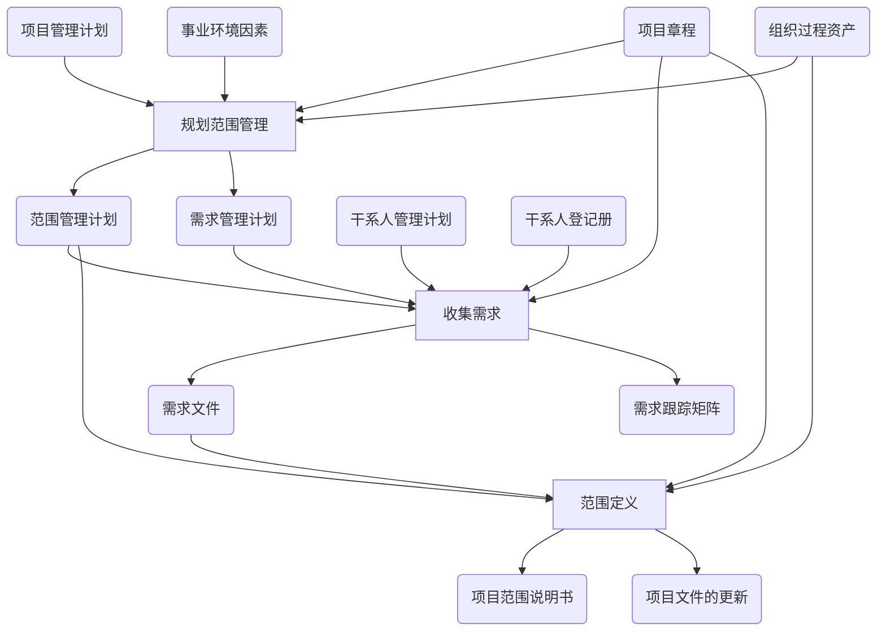

# 范围管理

* 产品范围：表示产品或服务的特性和功能。如何确定信息系统的范围在软件工程中被称为需求收集。
* 项目范围：为了完成所规定特征和功能的产品或服务必须完成的工作。

> 项目范围为生产出适合范围的产品所必须完成的工作。

> 如果把馒头看成一个产品，则馒头的范围就包括：颜色、形状、大小等。生产馒头就是一个项目，其范围就是生产出满足要求的馒头所必须做的工作：买面粉、和水等。

* 项目范围基准：范围说明书+WBS+WBS词典

**项目范围管理**不仅仅是让项目管理和施工人员知道为达到预期目标**需要完成的工作**，还确认清楚各相关方在项目中的**分工**界面和**职责**。

## 范围管理的过程 

|过程   | 英文名称|解释   |
|---|---|---|
|规划范围管理|Plan Scope Management|创建范围管理计划，**书面描述**将如何定义、确认、控制项目范围~~的过程~~ |
|收集需求|Collect Requirements |为实现项目目标而**确定**、**记录**并**管理**干系人的需要和需求~~的过程~~|
|定义范围|Define Scope|**制定**项目和产品详细**描述**~~的过程~~|
|创建WBS|Create WBS|将项目**可交付成果**和项目**工作分解**为较小的、易于管理的组件~~的过程~~ |
|确认范围|Validate Scope|正式**验收**项目已完成的可交付成果~~的过程~~ |
|控制范围|Control Scope|**监督**项目和产品的范围**状态**，**管理**范围基准**变更**~~的过程~~|

## 规划范围管理

在整个项目中对如何管理项目范围提供方向和指南。

* 输入：项目管理计划、项目章程、*事业环境因素*、*组织过程资产*
* 工具和方法：专家判断(Expert Judgment)、会议
* 输出：范围管理计划、需求管理计划

> 该过程主要目的是定义后面的过程应该怎么做，输出的都是**计划**

## 收集需求

为定义和管理项目范围（包括产品范围）奠定基础

* 输入：范围管理计划、需求管理计划、项目章程、干系人管理计划、干系人登记册
* 工具和方法：访谈、焦点小组、引导式研讨会、群体创新技术、群体决策技术、问卷调查、原型法、观察、标杆对照、系统交互图、文件分析
* 输出：需求文件、需求跟踪矩阵

> 该过程要干的活就是想尽一切办法从干系人处获得需求，所以输入有干系人管理计划和干系人登记册，由于项目章程里含有高层的目标，项目章程也做为输入，其输出为该过程的原始记录。

## 范围定义

明确所收集的需求哪些将包含在项目范围之内，哪些将排除在项目范围之外，从而**明确**产品、服务或成果的**边界**。

* 输入：项目章程、范围管理计划、需求文件、组织过程资产
* 工具：产品分析、备选方案生成、专家判断、引导式研讨会
* 输出：项目范围说明书、项目文件的更新

> 从客户（干系人）过来的是需求，需求经过整理后就成了项目的范围。该过程主要做的是和甲方明确项目的范围，以便项目团队能开展后期的工作，并明确不需要做的事情。该过程需要生成一个正式的文档《项目范围说明书》。

### 项目范围说明书

* **作用**
    * 使项目团队能**开展更详细**的规划，并在执行过程中**指导**项目团队的工作
    * 为评价**变更请求**或额外工作是否超出项目边界提供**基准**
* **内容**
    * 产品范围
    * 交付成果
    * 验收标准
    * 除外责任
    > 项目范围说明书是对项目范围、主要可交付成果、假设条件和制约因素的描述。它记录了整个范围，包括项目和产品的范围。项目范围说明也表明了干系人之间就项目范围达成的共识，并可明确指出哪些工作不属于项目范围。

## 创建WBS

对所要交付的内容提供一个结构化的视图。

> 为了便于管理，对上一步的结果进行分解为更小的组件。

* 输入：项目范围说明书、范围管理计划、需求文件、事业环境因素、组织过程资产
* 工具：分解、专家判断
* 输出：WBS、WBS词典、项目文件更新

**WBS+WBS词典+项目范围说明书构成范围基准。**

* **分解原则**

    * 100%。做且仅做项目的所有工作，包括分包出去的工作。
    * 完整性。各层次上保持项目的完整性。
    * 单一从属。有且只能有一个上属结构。
    * 单一负责。工作包有且只能有一个负责人。
    * 8/80原则。8小时或80天的工作量。

* **分解步骤**

    1. **识别**和分析**可交付成果**及**相关工作**
    2. **确定**WBS的**结构**与**编排方法**
    3. **自上而下**，逐层细化的**分解**
    4. 为WBS组成部分制定和**分配标志编码**
    5. **核实**工作分解的程度是必要且**充分**的

* **分解方法**

    * **生命周期**作为第一层，可交付物作为第二层
    * **可交付物**作为第一层
    * **子项目**作为第一层

## 数据流图

