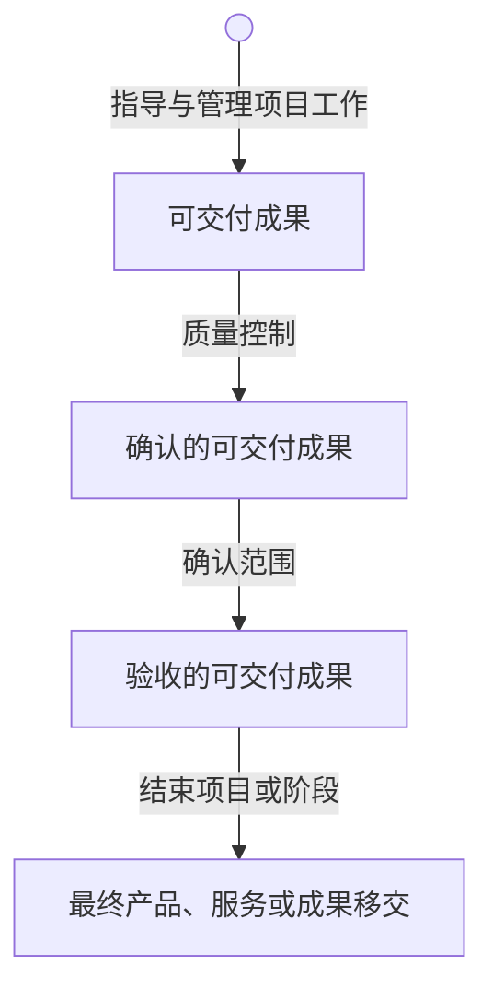
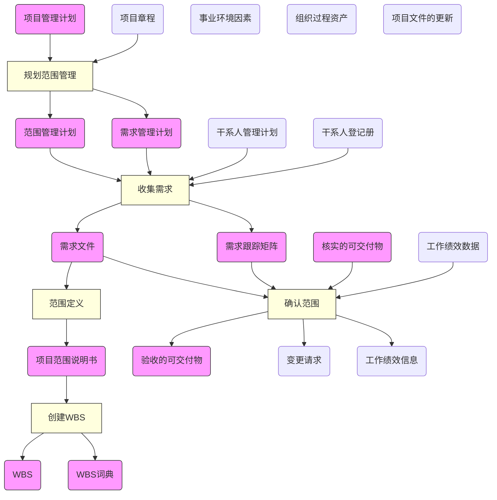

# 范围管理

* 产品范围：表示产品或服务的特性和功能。如何确定信息系统的范围在软件工程中被称为需求收集。
* 项目范围：为了完成所规定特征和功能的产品或服务必须完成的工作。

> 项目范围为生产出适合范围的产品所必须完成的工作。

> 如果把馒头看成一个产品，则馒头的范围就包括：颜色、形状、大小等。生产馒头就是一个项目，其范围就是生产出满足要求的馒头所必须做的工作：买面粉、和水等。

* 项目范围基准：范围说明书+WBS+WBS词典

**项目范围管理**不仅仅是让项目管理和施工人员知道为达到预期目标**需要完成的工作**，还确认清楚各相关方在项目中的**分工**界面和**职责**。

## 范围管理的过程 

|过程   | 英文名称|解释   |
|---|---|---|
|规划范围管理|Plan Scope Management|创建范围管理计划，**书面描述**将如何定义、确认、控制项目范围~~的过程~~ |
|收集需求|Collect Requirements |为实现项目目标而**确定**、**记录**并**管理**干系人的需要和需求~~的过程~~|
|定义范围|Define Scope|**制定**项目和产品详细**描述**~~的过程~~|
|创建WBS|Create WBS|将项目**可交付成果**和项目**工作分解**为较小的、易于管理的组件~~的过程~~ |
|确认范围|Validate Scope|正式**验收**项目已完成的可交付成果~~的过程~~ |
|控制范围|Control Scope|**监督**项目和产品的范围**状态**，**管理**范围基准**变更**~~的过程~~|

## 规划范围管理

在整个项目中对如何管理项目范围提供方向和指南。

* 输入：项目管理计划、项目章程、*事业环境因素*、*组织过程资产*
* 工具和方法：专家判断(Expert Judgment)、会议
* 输出：范围管理计划、需求管理计划

> 该过程主要目的是定义后面的过程应该怎么做，输出的都是**计划**

## 收集需求

为定义和管理项目范围（包括产品范围）奠定基础

* 输入：范围管理计划、需求管理计划、项目章程、干系人管理计划、干系人登记册
* 工具和方法：访谈、焦点小组、引导式研讨会、群体创新技术、群体决策技术、问卷调查、原型法、观察、标杆对照、系统交互图、文件分析
* 输出：需求文件、需求跟踪矩阵

> 该过程要干的活就是想尽一切办法从干系人处获得需求，所以输入有干系人管理计划和干系人登记册，由于项目章程里含有高层的目标，项目章程也做为输入，其输出为该过程的原始记录。

## 范围定义

明确所收集的需求哪些将包含在项目范围之内，哪些将排除在项目范围之外，从而**明确**产品、服务或成果的**边界**。

* 输入：项目章程、范围管理计划、需求文件、组织过程资产
* 工具：产品分析、备选方案生成、专家判断、引导式研讨会
* 输出：项目范围说明书、项目文件的更新

> 从客户（干系人）过来的是需求，需求经过整理后就成了项目的范围。该过程主要做的是和甲方明确项目的范围，以便项目团队能开展后期的工作，并明确不需要做的事情。该过程需要生成一个正式的文档《项目范围说明书》。

### 项目范围说明书

* **作用**
    * 使项目团队能**开展更详细**的规划，并在执行过程中**指导**项目团队的工作
    * 为评价**变更请求**或额外工作是否超出项目边界提供**基准**
* **内容**
    * 产品范围
    * 交付成果
    * 验收标准
    * 除外责任
    > 项目范围说明书是对项目范围、主要可交付成果、假设条件和制约因素的描述。它记录了整个范围，包括项目和产品的范围。项目范围说明也表明了干系人之间就项目范围达成的共识，并可明确指出哪些工作不属于项目范围。

## 创建WBS

对所要交付的内容提供一个结构化的视图。

> 为了便于管理，对上一步的结果进行分解为更小的组件。

* 输入：项目范围说明书、范围管理计划、需求文件、事业环境因素、组织过程资产
* 工具：分解、专家判断
* 输出：WBS、WBS词典、项目文件更新

**WBS+WBS词典+项目范围说明书构成范围基准。**

* **分解原则**

    * 100%。做且仅做项目的所有工作，包括分包出去的工作。
    * 完整性。各层次上保持项目的完整性。
    * 单一从属。有且只能有一个上属结构。
    * 单一负责。工作包有且只能有一个负责人。
    * 8/80原则。8小时或80天的工作量。
    * 便于管理和控制的需要。
    * 同性质。相同层次的工作单元就用相同的性质。

    > WBS的最低层次的工作单元是工作包。一个项目的WBS是否分解到工作包，要跟项目的阶段、复杂程度和规模有关，一般来说早期、复杂和大规模的项目，其WBS的分解颗粒要大一些、粗一些。

* **分解步骤**

    1. **识别**和分析**可交付成果**及**相关工作**
    2. **确定**WBS的**结构**与**编排方法**
    3. **自上而下**，逐层细化的**分解**
    4. 为WBS组成部分制定和**分配标志编码**
    5. **核实**工作分解的程度是必要且**充分**的

* **分解方法**

    * **生命周期**作为第一层，可交付物作为第二层
    * **可交付物**作为第一层
    * **子项目**作为第一层

* **表现形式**

    * 树形结构。
        > 清晰、直观、结构性强。不易修改，大的、复杂的项目难以表示全景。中小型项目应用较多。大项目需要再分解为子项目。
    * 列表形式。
        > 能够反映所有工作要素，常用于大型项目。

* **作用和意义**

    * **明确**说明项目**范围**。项目组成员能够清楚的理解任务的性质和需要努力的方向。
    * **清楚**定义项目的**边界**。提供项目干系人一致认可的项目需要做的工作和不需要做的工作。
    * 为各独立单元分派人员，确定这些人员的职责，可以**确定**完成项目所需要的**技术**和**人力资源**。
    * 针对独立单元，进行时间、费用和资源的需要量的估算，**提高估算**的**准确性**。
    * 为*计划*、*预算*、*进度安排*和*费用控制*奠定共同的基础，**确定**项目**进度**和**控制**的**基准**。
    * 将项目**工作**和项目的**账务账目联系**起来。（成本）
    * **确定**工作**内容**和工作**顺序**，把项目分解为具体的工作任务，就可以按照工作任务的逻辑顺序来**实施**项目。
    * **估计**项目整体和全过程的**费用**。
    * 有助于**防止需求蔓延**。

## 确认范围

使验收过程具有客观性；同时通过验收每个可交付物，提高最终产品、服务或成果验收的可能性。

* 输入：项目管理计划、需求文件、需求跟踪矩阵、核实的可交付物、工作绩效数据
* 工具：检查、群体决策技术
* 输出：验收的可交付成果、变更请求、工作绩效信息、项目文件更新

> 确认范围的过程中也可能产生范围变更。个人理解在未正式确认范围（验证完成）前，都可能产生范围的变更。

* **准备材料**

    * 能够**说明**项目或项目阶段**成果**的文件
        > * 项目管理文件
        > * 需求说明书
        > * 技术文件
        > * 竣工图纸
    * 客户已经**认可**了的这个项目产品或某个阶段的文件

* **工作要点**

    * 制定并执行确认程序
    * 项目干系统人对项目范围的正式承认
    * 让系统的使用者有效参与
    * 项目各阶段的确认与项目最终验收的确认

* **其它**

    * 如果项目在早期被终止，确认范围将记录其完成情况
    * 确认范围应该贯穿项目的始终
        > 项目在每个阶段都有工作完成，其完成情况都应该被确认。
    * 确认范围一般在质量控制之后，但是也可以并行执行。
    * 确认范围关注工作结果的接受度；质量控制关注工作结果的正确性。
        > 范围是必须完成的工作，若未完成，则客户不会接受。质量则关注在当前范围内，事情有没有做正确。
    * 质量控制是在项目团队**内部**由执行组织进行检查。

* **可交付物变化**

## 控制范围

保持对范围基准的维护。

> 该过程贯穿项目始终。

* 输入：项目管理计划、工作绩效数据、需求文件、需求跟踪矩阵、组织过程资产
* 工具：偏差分析
* 输出：工作绩效信息、变更请求、项目管理计划更新、项目文件更新、组织过程资产更新

> 所有过程产生的输出均可做为控制过程的输入，对输入数据处理后产生对应的输出。

* **涉及内容**
    * **影响**导致围范变更的**因素**。
    * **确保**所有变更请求按照项目整体变更控制**过程**处理。
    * 范围变更时**管理**实际的**变更**。
    * 控制范围还要与其它控制过程相结合。

* **焦点问题**
    * 对造成范围变更的因素**施加影响**，以确保这些变更得到一致认可。
    * **确定**范围变更是否已经发生。
    * 当范围变更发生时，对实际的变更进行**管理**。

* **变更原因**
    * 项目的**外部环境**发生变化
    * 项目范围的**计划**编制**不周**密详细，有一定的错误或遗漏
    * 市场上或设计人员提出了**新技术**、**新手段**或**新方案**
    * **项目**实施**组织**本身发生变化
    * **客户**对项目、项目产品或服务的**要求**发生变化

## 数据流图

